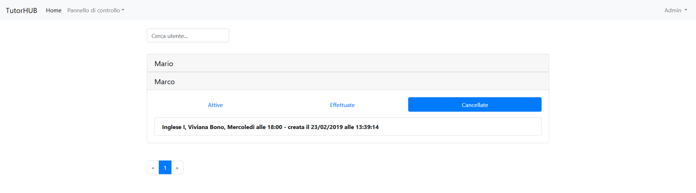

# IUM-TWEB-SERVER [](https://travis-ci.org/BrunoLopardo/IUM-TWEB-SERVER)

Web application that manages online private lessons bookings based on the Model View Controller (MVC) Architecture made using Java Servlets and AngularJS.

Project developed for the *Web Technologies and Human-computer interaction* course at Turin University (2018-2019).

### Prerequisites

You need the [IUM-TWEB-DB](https://github.com/BrunoLopardo/IUM-TWEB-DB) database.

Edit database url, user and password in:
```
web/WEB-INF/web.xml
```

## Built With

* Java
* AJAX
* AngularJS
* JavaScript
* HTML
* JPS
* Bootstrap
* PosgreSQL

## Authors

* **Bruno Lopardo** 
* **Luca Molinaro** 

## Preview



